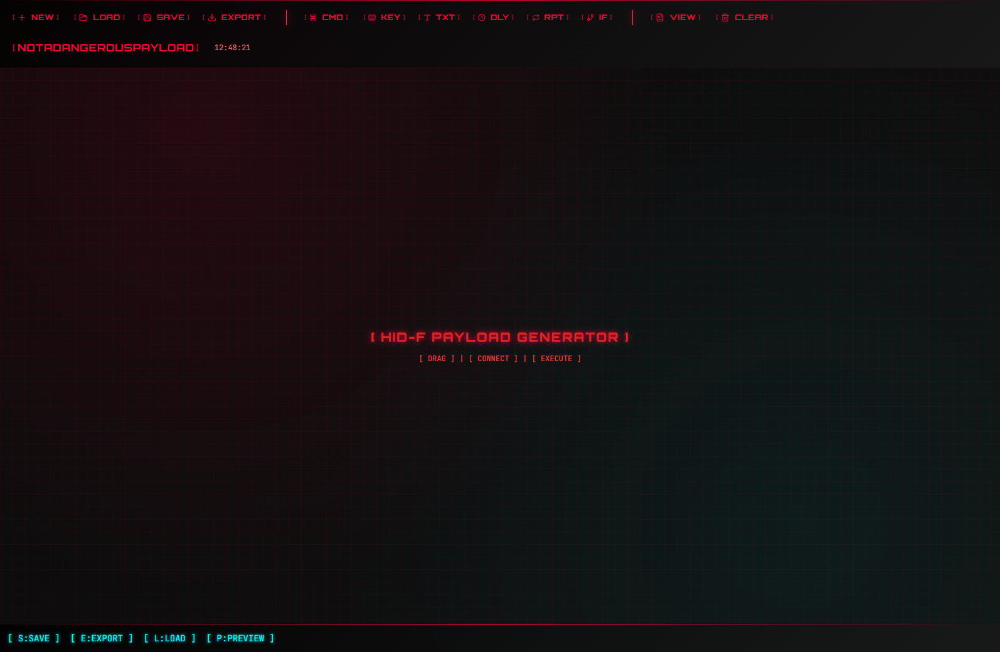
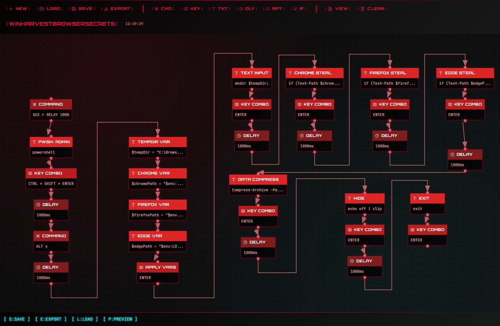
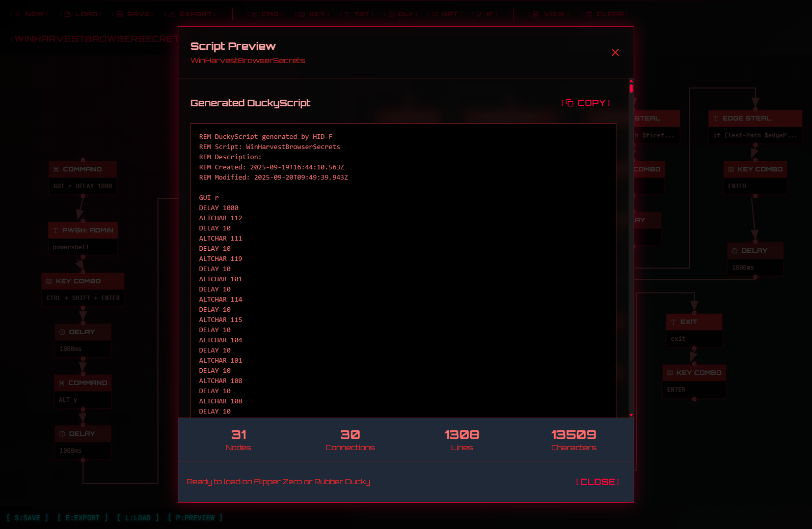

# HID-F Payload Generator

[](https://github.com/s4lieri-the-f/HID-F/actions/workflows/build-and-release.yml)
[](https://github.com/s4lieri-the-f/HID-F/actions/workflows/deploy-pages.yml)
[](https://hub.docker.com/r/s4lier1/hid-f)
[](https://s4lieri-the-f.github.io/HID-F/)

*Client-side web application for low-code DuckyScript compilation with visual node-based programming interface.*

<div align="center">
  
</div>

## Features

- **Visual Node Editor** - Drag and drop interface for creating DuckyScript payloads
    <div align="center">
    
    </div>
- **Auto-Conversion** - Automatically converts STRING inputs to ALTCHAR sequences
- **Real-time Preview** - See your generated script as you build
    <div align="center">
    
    </div>
- **One-Click Copy** - Easy copying of generated scripts
- **Docker Ready** - Easy deployment with Docker containers

## Quick Start

### **[Try it online](https://s4lieri-the-f.github.io/HID-F/)**

### Using Docker

```bash
# Pull and run the latest image
docker pull s4lier1/hid-f:latest
docker run -p 3000:80 --name hidf s4lier1/hid-f:latest
```

Visit `http://localhost:3000` in your browser.

### Using Docker Compose (Recommended)

```bash
# Clone the repository
git clone https://github.com/s4lieri-the-f/HID-F.git
cd HID-F

# Start the application
docker-compose up -d
```

### Development Setup

```bash
# Install dependencies
npm ci

# Start development server
npm run dev

# Build for production
npm run build
```

### GitHub Pages Deployment

The app is automatically deployed to GitHub Pages on every push to the `master` branch:

- **Live URL**: https://s4lieri-the-f.github.io/HID-F/
- **Deployment**: Automatic via GitHub Actions
- **Build**: Static files generated with SvelteKit

## Project Structure

```
src/
├── lib/
│   ├── components/          # Svelte components
│   │   ├── Canvas.svelte    # Main node editor canvas
│   │   ├── Node.svelte      # Individual node component
│   │   ├── Connection.svelte # Node connections
│   │   └── ...
│   ├── types/               # TypeScript type definitions
│   └── utils/               # Utility functions
├── routes/                  # SvelteKit routes
└── app.html                # Main HTML template
```

## Development

### Prerequisites

- Node.js 20+
- npm or yarn
- Docker (optional)

### Available Scripts

```bash
npm run dev          # Start development server
npm run build        # Build for production
npm run preview      # Preview production build
npm run check        # Run type checking
npm run format       # Format code with Prettier
```

### Contributing

1. Fork the repository
2. Create a feature branch (`git checkout -b feature/newfeature`)
3. Commit your changes (`git commit -m 'Add some amazing feature'`)
4. Push to the branch (`git push origin feature/newfeature`)
5. Open a Pull Request

## Docker Images

| Tag | Description |
|-----|-------------|
| `latest` | Latest stable release |
| `master` | Latest from master branch |
| `v1.0.0` | Specific version tag |

## Configuration

### Environment Variables

| Variable | Default | Description |
|----------|---------|-------------|
| `PORT` | `80` | Port for the web server |
| `NODE_ENV` | `production` | Environment mode |

### Docker Compose

The included `docker-compose.yml` provides:

- Automatic image building
- Port mapping (3000:80)
- Health checks
- Restart policies

## License

This project is licensed under the MIT License - see the [LICENSE.md](LICENSE.md) file for details.

## Support

If you encounter any issues or have questions:

1. Check the [Issues](https://github.com/s4lieri-the-f/HID-F/issues) page
2. Create a new issue with detailed information

---

<div align="center">
  <p>
    <a href="https://github.com/s4lieri-the-f/HID-F">GitHub</a> •
    <a href="https://hub.docker.com/r/s4lier1/hid-f">Docker Hub</a> •
    <a href="https://github.com/s4lieri-the-f/HID-F/issues">Issues</a>
  </p>
</div>